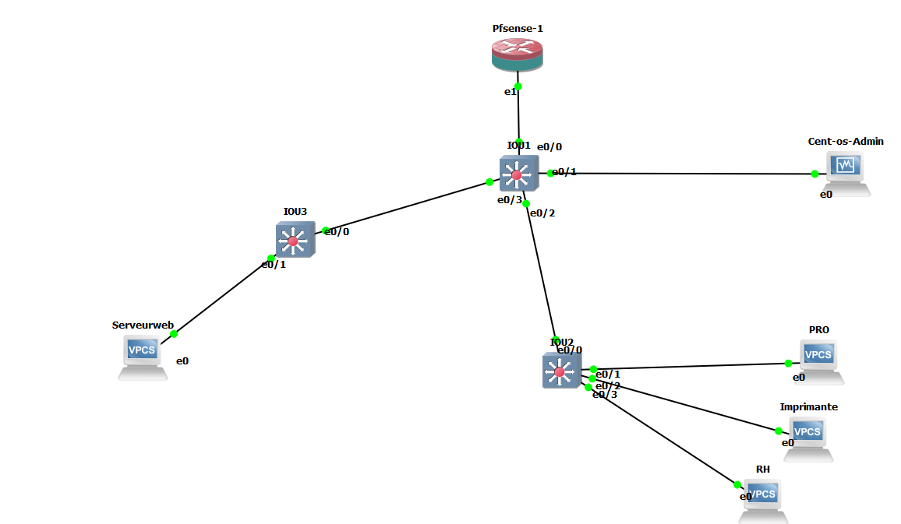
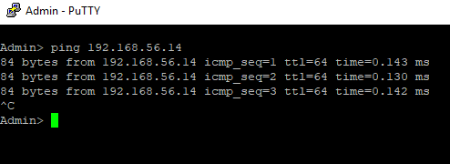
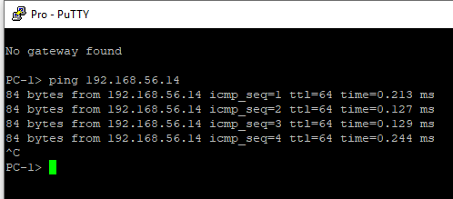
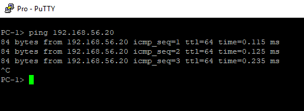
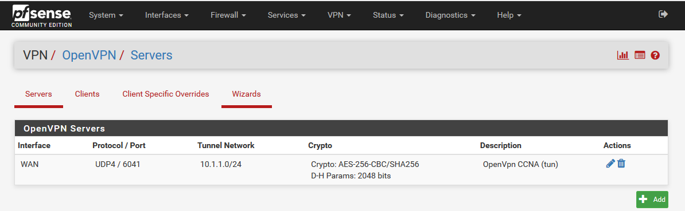
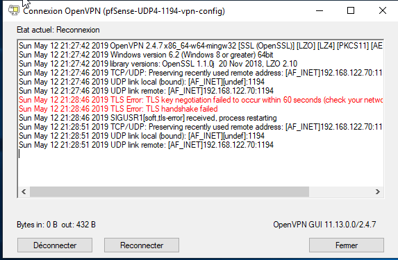
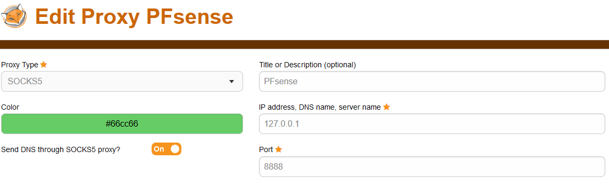

Shéma de la Topologie:*
```bash

                                                                 192.168.56.10
                                                                +------------------+
                                  +-----------+                 |                  |
                                  |           |                 |                  |
                                  |    NAT    +-----------------+     Pfsense      |
                                  |           |                 |                  |
                                  +-----------+                 |                  |
                                                                +--------+---------+
                                                                         |
                                                                         |
                                                                   Trunk |
                                                                         |
                                                                         |
192.168.56.20                                                            |                                192.168.56.11
   +--------+                 +-----------------+                +-------+---------+                     +--------+
   | Serveur|     Vlan 50     |                 |     Trunk      |                 |       Vlan 10       | Admin  |
   |        +-----------------+     Switch      +----------------+     Switch      +---------------------+        |
   |        |                 |                 |                |                 |                     |        |
   +--------+                 +-----------------+                +-------+---------+                     +--------+
                                                                         |
                                                                         |
                                                                         |
                                                                   Trunk |
                                                                         |
                                                                         |
                                                                         |
                                                                 +-------+---------+    Vlan 20     192.168.56.12
                                                                 |                 |               +---------+
                                                                 |     Switch      +---------------+         |
                                                                 |                 |               |   Pro   |
                                                                 +-+-------------+-+               |         |
                                                                   |             |                 +---------+
                                                                   |             |
                                                          vlan 40  |             |  Vlan 30
                                                                   |             |
                                                                   |             |
                                                                   |             |
                                                              +----+----+    +---+----+
                                                              |         |    |        |
                                                              Imprimante|    |   RH   |
                                                              |         |    |        |
                                                              +---------+    +--------+
                                                            192.168.56.14    192.168.56.13


 ```
### Tableau résumé
Hosts | `` |  `` |  `` | `` | ``
--- | --- | --- | --- | --- | ---
`server` | `192.168.56.20/24` | x | x | x | x
`imprimante` | x | `192.168.56.14/24` | x | x | x
`pro` | x | x | `192.168.56.12/24` | x | x
`RH` | x | x | x | `192.168.56.13/24` | x
`admin` | x | x | x | x | `192.168.56.11/24`



On trouve:
- un pare-feu frontal
- un admin
- un pro 
- une imprimante
- un RH
- un serveur web
- 3 switch

Test de connexion:
- admin vers imprimante: 



- pro vers imprimante:


- pro vers serveur:



VPN:



J ai rencontré un problème lors de la connexion au vpn:


j'ai testé pas mal de configuration mais toujours le même problème que je n'ai pas reussi à résoudre.

Commande utilisée pour accéder à l'interface pfsence sur un navigateur en passant par le pc admin 

ssh root@192.168.80.4 -D 8888 -N

paramétre du proxy sur le navigateur:


